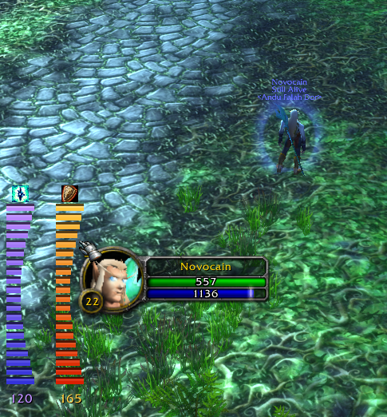

# ShieldBar

Absorb shield tracker for OctoWoW.

Displays remaining absorb HP as segmented bars on screen — **one bar per active shield**,
each with its own colour and spell icon, so stacked shields are tracked separately.

Absorbed damage is routed to the shield that would actually eat it: Fire Ward only takes
fire damage, Frost Ward only frost, Shadow Ward only shadow, and everything else falls
through to the generic shields (Power Word: Shield, Mana Shield, Ice Barrier).

Protection potions are routed the same way — a Greater Fire Protection Potion only takes
fire damage. The school is read from the buff's own name, so potions that name no school
stay generic and absorb anything.

**Absorb shields** — the bar shows remaining absorb HP:
- Power Word: Shield (Priest)
- Sacrifice (Warlock Voidwalker)
- Shadow Ward (Warlock)
- Ice Barrier (Mage)
- Frost Ward (Mage)
- Fire Ward (Mage)
- Mana Shield (Mage)
- Protection potions

**Charge shields** — the bar shows remaining charges:
- Water Shield (Shaman)
- Lightning Shield (Shaman)
- Earth Shield (Shaman) — also found on your target or party members

## Options

Type `/shieldbar` or `/sb` to open the options window — or right-click any bar.

Everything is configured there: visibility, lock, vertical/horizontal layout,
which side extra bars grow towards, straight/curved shape, bar size, and reset.
Left-drag the bars to move them, Escape closes the window.

When a second shield goes up it needs somewhere to go, and the frame grows away
from whichever screen edge you dragged it to. **Grow right/left** (or down/up
when laid out horizontally) picks which end the first bar keeps, so an extra
shield can appear beside the bar you were already watching instead of shoving
it aside.

While the options window is open the bars stand in as a live example — three
shields, so layout, growth direction, shape and size are all visible as you
change them, without having to go find three buffs first. The example is drawn
by the real bars rather than a separate mock-up, so it cannot drift from what
you will actually get. It disappears when you close the window, and absorbed
damage is never routed into it.

### Text commands

Still available for macros:

| Command | Description |
|---|---|
| `show` / `hide` | Always visible, or only in combat with an active shield |
| `vertical` / `horizontal` | Bar layout |
| `curve` / `straight` | Bar shape |
| `curve rotate` | Flip curve direction |
| `grow right` / `grow left` | Which side extra bars appear on (vertical layout) |
| `grow down` / `grow up` | Same setting, named for the horizontal layout |
| `size <1-5>` | Bar size — 1 smallest, 5 largest (default: 3) |
| `lock` / `unlock` | Lock or unlock bar position |
| `debug` | List your active buffs with texture path and parsed absorb value |
| `reset` | Reset all settings to default |

## Installation

1. Download and extract the `ShieldBar` folder.
2. Make sure the folder is named `ShieldBar` — GitHub may extract it as `ShieldBar-main`. Rename it if so.
3. Place it in `World of Warcraft/Interface/AddOns/`.
4. Reload the UI or log in — the bar appears on the right side of the screen.
